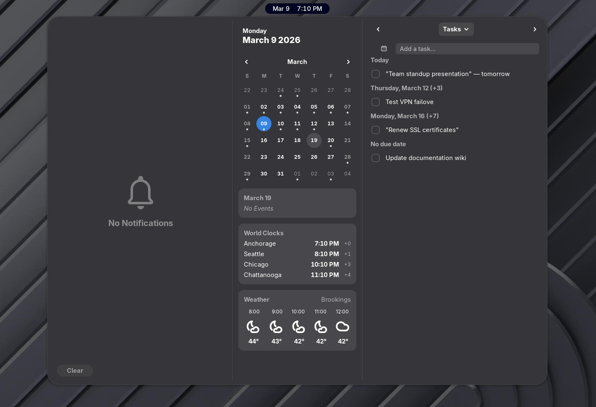
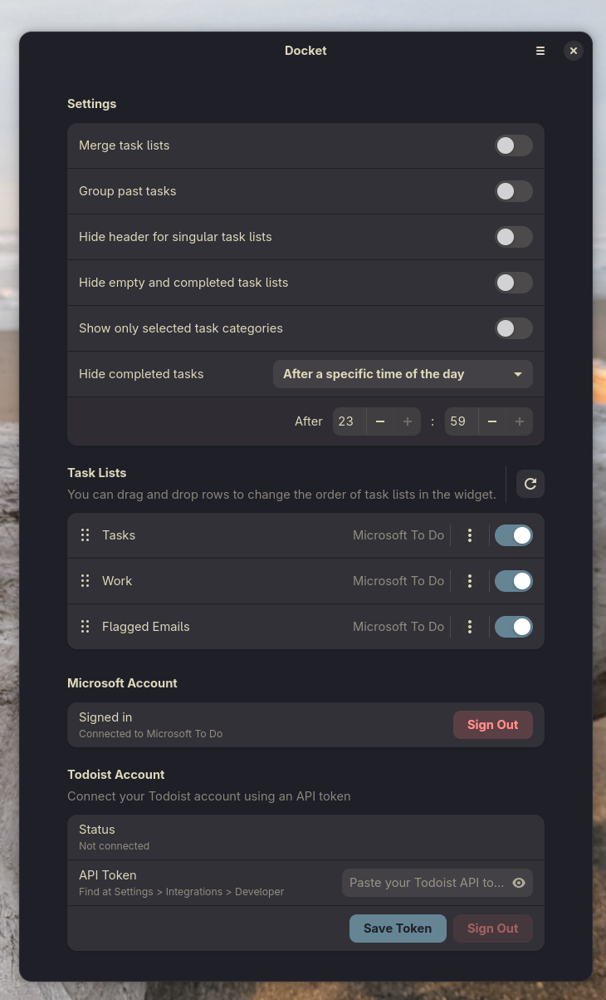

# Docket

A GNOME Shell extension that puts your Microsoft To Do and Todoist tasks next to the calendar in the date menu using MS Graph API and Todoist API.



## Features

- **Microsoft To Do** and **Todoist** support
- Quick-add tasks with an inline calendar date picker for due dates
- Complete, delete, and edit tasks inline
- Checklist items (Graph) and subtasks (Todoist)
- Switch between task lists, or merge them into one view
- Filter by category (Past, Today, Tomorrow, Next 7 Days, Scheduled, etc.)
- Sort by name, due date, or priority
- Hide completed tasks (immediately, after a time period, or after a specific time of day)
- Reorder and toggle task list visibility in Settings
- Offline task cache — tasks persist to disk and load instantly on startup
- Delta sync — only fetches changes since last sync
- Background polling (30s while open, configurable interval while closed)

## Installation

### Dependencies

- GNOME Shell 48 or 49
- libsoup3
- libsecret (GNOME Keyring)

### Build from Source

**Ubuntu 24.04+**
```bash
sudo apt install meson ninja-build gettext libglib2.0-bin libglib2.0-dev-bin gir1.2-soup-3.0 gir1.2-secret-1
```

**Fedora 40+**
```bash
sudo dnf install meson ninja-build gettext glib2-devel libsoup3 libsecret
```

**CachyOS / Arch Linux**
```bash
sudo pacman -S meson ninja gettext glib2 libsoup3 libsecret
```

Then build and install:

```bash
git clone https://github.com/DanielTylerReece/Docket.git
cd Docket
meson setup builddir --prefix="$HOME/.local"
meson install -C builddir
```

Restart GNOME Shell (log out/in on Wayland, or Alt+F2 → `r` on X11) and enable via the GNOME Extensions app.

To rebuild after changes:

```bash
meson setup builddir --prefix="$HOME/.local" --wipe && meson install -C builddir
```

## Setup

### Microsoft To Do

1. Open extension preferences (GNOME Extensions → Docket → Settings)
2. Click **Sign In** under Microsoft Account
3. Complete the device code flow (code is copied to clipboard automatically)

### Todoist

1. Open extension preferences
2. Under **Todoist Account**, paste your API token (Todoist → Settings → Integrations → Developer)
3. Click **Save Token**

Sign out from either service individually in Settings.



## Credits

Originally forked from [Task Widget](https://gitlab.com/jmiskinis/gnome-shell-extension-task-widget) by Juozas Miskinis. Rewritten to use Microsoft Graph API and Todoist API instead of Evolution Data Server.

## License

GPL-2.0
